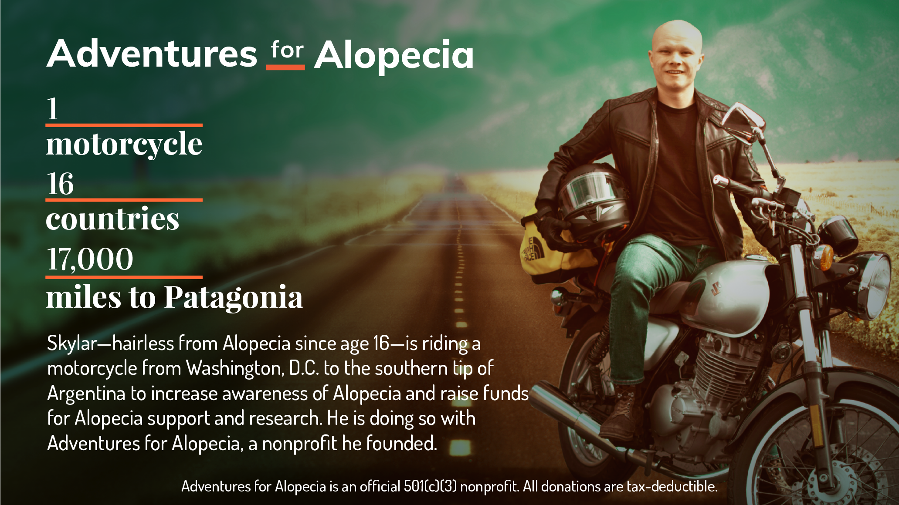

<!--  -->

# Adventures for Alopecia: Serverless Backend

## What is Adventures for Alopecia? :motorcycle::dash::dash:

[Adventures for Alopecia](https://projectafa.org) (Project AFA) is a 501(c)(3) nonprofit organization supporting children and adults living with Alopecia. We achieve our mission through three main program areas: support, awareness, and research.

**Support.** We host support group events throughout North America, Central America, and South America.  
**Awareness.** We educate the public about Alopecia through social media, press, word of mouth, and speaking engagements.  
**Research.** We contribute a portion of the funds we raise to the National Alopecia Areata Foundation, an existing 501(c)(3) nonprofit dedicated to discovering a cure for Alopecia.

After Skylar's inaugural Adventure for Alopecia, Project AFA will use donations to sponsor adventures for other Alopecians to regain their confidence through adventure and travel.

## What is this repo?

Here lies the backend source code for AFA's web presence. For more information on the project, tech stack, and more, visit the [front-end repp](https://github.com/skylarweaver/front-end-afa).

### Credits
- Developed and maintained by [Skylar Weaver](https://github.com/skylarweaver)